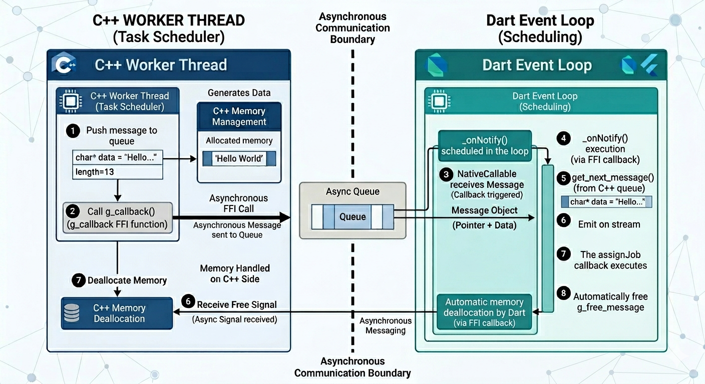
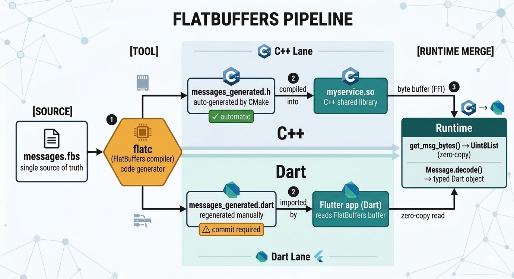
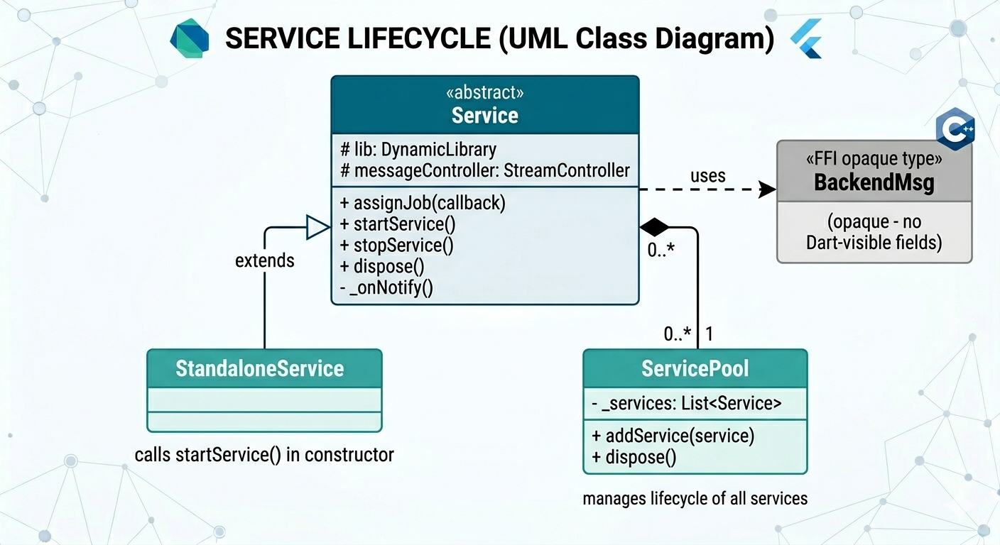

# flutter_cpp_bridge

A Flutter package that simplifies calling C++ shared libraries (`.so`) from Dart via `dart:ffi`.

`flutter_cpp_bridge` gives you three building blocks — **Service**, **ServicePool**, and **StandaloneService** — that handle library loading, lifecycle, and **event-driven message delivery** (no polling, zero CPU at idle).

> **Target platform: Linux**, including embedded targets such as [flutter-pi](https://github.com/ardera/flutter-pi) (Raspberry Pi and similar SBCs).



## Features

- Load any `.so` with a single line; extra C functions bound via subclassing.
- Event-driven delivery via `NativeCallable`: C++ notifies Dart the moment a message is ready.
- `fcb::Queue<T>` / `fcb::CurrentValue<T>` + code-generation macros — write only what is unique to your service.
- Byte-buffer variant (`FCB_EXPORT_BYTES_SYMBOLS`) for FlatBuffers / protobuf payloads.
- Standalone services for command sinks, loggers, one-shot calls.

## Acknowledgements

Special thanks to [grybouilli](https://github.com/grybouilli) for his significant contributions to this project!

## Getting started

```yaml
dependencies:
  flutter_cpp_bridge:
    git:
      url: https://github.com/Renaud-Barrau/flutter_cpp_bridge
      ref: main
```

## C++ side

Every library must export **five** symbols with C linkage. The package ships a header-only helper at `linux/include/flutter_cpp_bridge/service_helpers.h` that generates them for you.

### Pooled service — `fcb::Queue<T>`

Each `push()` enqueues one message; Dart reads them FIFO.

```cpp
#include <chrono>
#include "flutter_cpp_bridge/service_helpers.h"

struct my_message_t { int value; };

static fcb::Queue<my_message_t> g_svc;

static void worker(fcb::Queue<my_message_t>& svc) {
    int i = 0;
    while (!svc.stopped()) {
        svc.push({i++});
        std::this_thread::sleep_for(std::chrono::seconds(1));
    }
}

FCB_EXPORT_SYMBOLS(g_svc, worker)

FCB_EXPORT int get_value(my_message_t* msg) { return msg->value; }
```

Use `fcb::CurrentValue<T>` instead of `fcb::Queue<T>` when only the latest value matters (sensor readings, etc.): `set()` overwrites the stored value; Dart reads it once then releases.

### Standalone service (no message queue)

For libraries that don't produce messages (command sinks, loggers…):

```cpp
#include <cstdio>
#include "flutter_cpp_bridge/service_helpers.h"

FCB_EXPORT_STANDALONE_NOOP()   // or FCB_EXPORT_STANDALONE(start_fn, stop_fn)

FCB_EXPORT void hello() { printf("Hello from C++!\n"); fflush(stdout); }
```

### Byte-buffer service (FlatBuffers, protobuf…)




`FCB_EXPORT_BYTES_SYMBOLS` generates the five mandatory symbols **plus** `get_msg_bytes` / `get_msg_len`, which let Dart read the raw buffer zero-copy.

```cpp
#include "flutter_cpp_bridge/service_helpers.h"
#include "messages_generated.h"   // generated by CMake from messages.fbs

static fcb::BytesQueue g_svc;     // fcb::Queue<std::vector<uint8_t>>

static void worker(fcb::BytesQueue& svc) {
    while (!svc.stopped()) {
        flatbuffers::FlatBufferBuilder fbb;
        // ... build your FlatBuffers message ...
        svc.push(fcb::BytesMsg{fbb.GetBufferPointer(),
                               fbb.GetBufferPointer() + fbb.GetSize()});
        std::this_thread::sleep_for(std::chrono::seconds(1));
    }
}

FCB_EXPORT_BYTES_SYMBOLS(g_svc, worker)
```

#### ZMQ transport variant

The worker can receive messages over any transport and act as a **router**: a switch-case decides which messages are forwarded to Dart; the rest are silently dropped.

```cpp
#include <zmq.hpp>
#include "flutter_cpp_bridge/service_helpers.h"
#include "messages_generated.h"

static fcb::BytesQueue g_svc;

static void worker(fcb::BytesQueue& svc) {
    zmq::context_t ctx;
    zmq::socket_t  sub(ctx, ZMQ_SUB);
    sub.connect("ipc:///tmp/my_channel");
    sub.set(zmq::sockopt::subscribe, "");

    while (!svc.stopped()) {
        zmq::message_t raw;
        if (!sub.recv(raw, zmq::recv_flags::dontwait)) {
            std::this_thread::sleep_for(std::chrono::milliseconds(1));
            continue;
        }
        auto bytes = static_cast<const uint8_t*>(raw.data());
        auto msg   = flatbuffers::GetRoot<MyMessage>(bytes);
        switch (msg->payload_type()) {
            case Payload_Foo:
                svc.push(fcb::BytesMsg(bytes, bytes + raw.size()));
                break;
            // unhandled types are silently dropped
        }
    }
}

FCB_EXPORT_BYTES_SYMBOLS(g_svc, worker)
```

Requires `libzmq3-dev` and `cppzmq-dev` (see [CMake — ZMQ](#cmake--zmq) below).

## Dart API — class hierarchy



## Dart / Flutter side

### 1. Subclass `Service`

```dart
import 'dart:ffi';
import 'package:flutter_cpp_bridge/flutter_cpp_bridge.dart';

class MyService extends Service {
  MyService(super.libname) {
    getValue = lib
        .lookup<NativeFunction<Int32 Function(Pointer<BackendMsg>)>>('get_value')
        .asFunction<int Function(Pointer<BackendMsg>)>();
  }
  late final int Function(Pointer<BackendMsg>) getValue;
}
```

### 2. Byte-buffer services (FlatBuffers)

```dart
import 'dart:ffi';
import 'package:flutter_cpp_bridge/flutter_cpp_bridge.dart';
import 'messages_generated.dart';   // generated by flatc (see below)

class MyMessageService extends Service {
  MyMessageService(super.libname) {
    _getBytes = lib
        .lookup<NativeFunction<Pointer<Uint8> Function(Pointer<BackendMsg>)>>(
            'get_msg_bytes')
        .asFunction();
    _getLen = lib
        .lookup<NativeFunction<Uint32 Function(Pointer<BackendMsg>)>>(
            'get_msg_len')
        .asFunction();
  }

  late final Pointer<Uint8> Function(Pointer<BackendMsg>) _getBytes;
  late final int Function(Pointer<BackendMsg>) _getLen;

  MyMessage? decode(Pointer<BackendMsg> msg) =>
      MyMessage(_getBytes(msg).asTypedList(_getLen(msg)));
}
```

The `Uint8List` is a **zero-copy view** into the C++ buffer, valid only for the duration of the `assignJob` callback.

#### Generating the Dart file from a FlatBuffers schema

The C++ header is regenerated automatically by CMake. The Dart file must be regenerated manually and committed:

```bash
flatc --dart -o lib/ linux/myservice/messages.fbs
# produces lib/messages_<namespace>_generated.dart
```

> Add `flat_buffers` to `pubspec.yaml`: `flat_buffers: ^25.9.23`

### 3. Lifecycle — `ServicePool`

Register a job **before** adding the service so no early message is missed:

```dart
final pool    = ServicePool();
final service = MyService('libmyservice.so');

service.assignJob((msg) {
  print('value: ${service.getValue(msg)}');
  // freeMessage is called automatically after this callback returns.
});

pool.addService(service);   // calls start_service; Dart wakes up on demand
// ...
pool.dispose();             // stops all services, releases native callbacks
```

If you use `flutter_riverpod`, each service fits naturally inside a `Notifier`: call `service.startService()` in `build()` and `ref.onDispose(service.dispose)` — no `ServicePool` needed.

### 4. Standalone services

```dart
class HelloService extends StandaloneService {
  HelloService(super.libname) {
    hello = lib
        .lookup<NativeFunction<Void Function()>>('hello')
        .asFunction<void Function()>();
  }
  late final void Function() hello;
}

final greeter = HelloService('libhello.so');
greeter.hello();   // C++ already running — started in constructor
```

## How event-driven delivery works

```
C++ worker thread                 Dart event loop
─────────────────                 ───────────────
push message to queue
call g_callback()   ──────────►  _onNotify() scheduled
                                  └─ get_next_message() → emit on stream
                                  └─ assignJob callback runs
                                  └─ free_message called automatically
```

`NativeCallable.listener` (Dart SDK ≥ 3.1) makes this thread-safe: the C++ thread calls the native pointer and returns immediately; Dart processes the notification on its event loop without blocking.

## Compiling your C++ libraries (Linux)

### CMakeLists for your library

```cmake
cmake_minimum_required(VERSION 3.13)
project(myservice LANGUAGES CXX)

add_library(myservice SHARED myservice.cpp)
target_compile_features(myservice PRIVATE cxx_std_17)
target_include_directories(myservice PRIVATE "${FCB_CPP_INCLUDE}")
set_target_properties(myservice PROPERTIES
  CXX_VISIBILITY_PRESET default
  PREFIX ""   # produce myservice.so, not libmyservice.so
)
```

### Wiring into the Flutter app's `linux/CMakeLists.txt`

```cmake
# Path to the flutter_cpp_bridge C++ helpers header (symlink created by flutter pub get).
set(FCB_CPP_INCLUDE
  "${CMAKE_CURRENT_SOURCE_DIR}/flutter/ephemeral/.plugin_symlinks/flutter_cpp_bridge/linux/include"
)

add_subdirectory("myservice")

install(TARGETS myservice
  LIBRARY DESTINATION "${INSTALL_BUNDLE_LIB_DIR}"
  COMPONENT Runtime
)
```

The Flutter Linux runner sets `RPATH=$ORIGIN/lib`, so `.so` files in `bundle/lib/` are found automatically at runtime.

### CMake — FlatBuffers

```cmake
include(FetchContent)
FetchContent_GetProperties(flatbuffers)
if(NOT flatbuffers_POPULATED)               # guard: only declare once
    FetchContent_Declare(flatbuffers
        GIT_REPOSITORY https://github.com/google/flatbuffers.git
        GIT_TAG v24.3.25 GIT_SHALLOW TRUE)
    set(FLATBUFFERS_BUILD_TESTS    OFF CACHE BOOL "" FORCE)
    set(FLATBUFFERS_BUILD_FLATLIB  OFF CACHE BOOL "" FORCE)
    set(FLATBUFFERS_BUILD_FLATHASH OFF CACHE BOOL "" FORCE)
    set(FLATBUFFERS_INSTALL        OFF CACHE BOOL "" FORCE)
    FetchContent_MakeAvailable(flatbuffers)
    FetchContent_GetProperties(flatbuffers)
endif()

set(GENERATED_HEADER "${CMAKE_CURRENT_BINARY_DIR}/messages_generated.h")
add_custom_command(
    OUTPUT  "${GENERATED_HEADER}"
    COMMAND "$<TARGET_FILE:flatc>" --cpp --gen-mutable
            -o "${CMAKE_CURRENT_BINARY_DIR}" "${CMAKE_CURRENT_SOURCE_DIR}/messages.fbs"
    DEPENDS "${CMAKE_CURRENT_SOURCE_DIR}/messages.fbs" flatc VERBATIM)
add_custom_target(myservice_fbs DEPENDS "${GENERATED_HEADER}")

add_library(myservice SHARED myservice.cpp)
add_dependencies(myservice myservice_fbs)
target_include_directories(myservice PRIVATE
    "${FCB_CPP_INCLUDE}"
    "${flatbuffers_SOURCE_DIR}/include"
    "${CMAKE_CURRENT_BINARY_DIR}")
set_target_properties(myservice PROPERTIES CXX_VISIBILITY_PRESET default PREFIX "")
```

### CMake — ZMQ

Install system packages: `libzmq3-dev` (runtime + C headers) and `cppzmq-dev` (C++ bindings `zmq.hpp`).

```cmake
find_package(PkgConfig REQUIRED)
pkg_check_modules(ZMQ REQUIRED IMPORTED_TARGET libzmq)
find_path(CPPZMQ_INCLUDE_DIR zmq.hpp REQUIRED)

target_include_directories(myservice PRIVATE ... "${CPPZMQ_INCLUDE_DIR}")
target_link_libraries(myservice PRIVATE PkgConfig::ZMQ)
```

> **flutter-pi:** deploy `.so` files to the `lib/` directory relative to your app executable — flutter-pi honours the same `$ORIGIN/lib` RPATH convention.

## Example

A complete working example is in [`example/`](example/):

| Library | Type | What it does |
|---------|------|--------------|
| `liba.so` | Pooled `Service` | Random RGB colour every 2 s |
| `libb.so` | Pooled `Service` | Random word every 2 s |
| `libalone.so` | `StandaloneService` (no-op) | Exposes `hello()` |
| `libc.so` | `StandaloneService` (real start/stop) | Counter with increment |
| `libmessage.so` | Byte-buffer `Service` | FlatBuffers `ColorMsg` / `TextMsg` every 1 s |
| `libmessagezmq.so` | Byte-buffer `Service` + ZMQ | Receives FlatBuffers from an external ZMQ PUB; C++ switch-case filters before forwarding to Dart |

After any schema change, regenerate the Dart file and commit it:

```bash
flatc --dart -o example/lib/ example/linux/libmessage/messages.fbs
# produces example/lib/messages_fcb_msgs_generated.dart
```

## Platform support

| Platform | Status |
|----------|--------|
| Linux desktop & embedded | **Primary target** |
| flutter-pi (Raspberry Pi, SBCs) | **Intended use case** |
| macOS / Windows | Dart abstractions work; `.so` loading and CMake wiring need adapting |
| Android / iOS | Not tested; `dart:ffi` works but build integration not provided |
